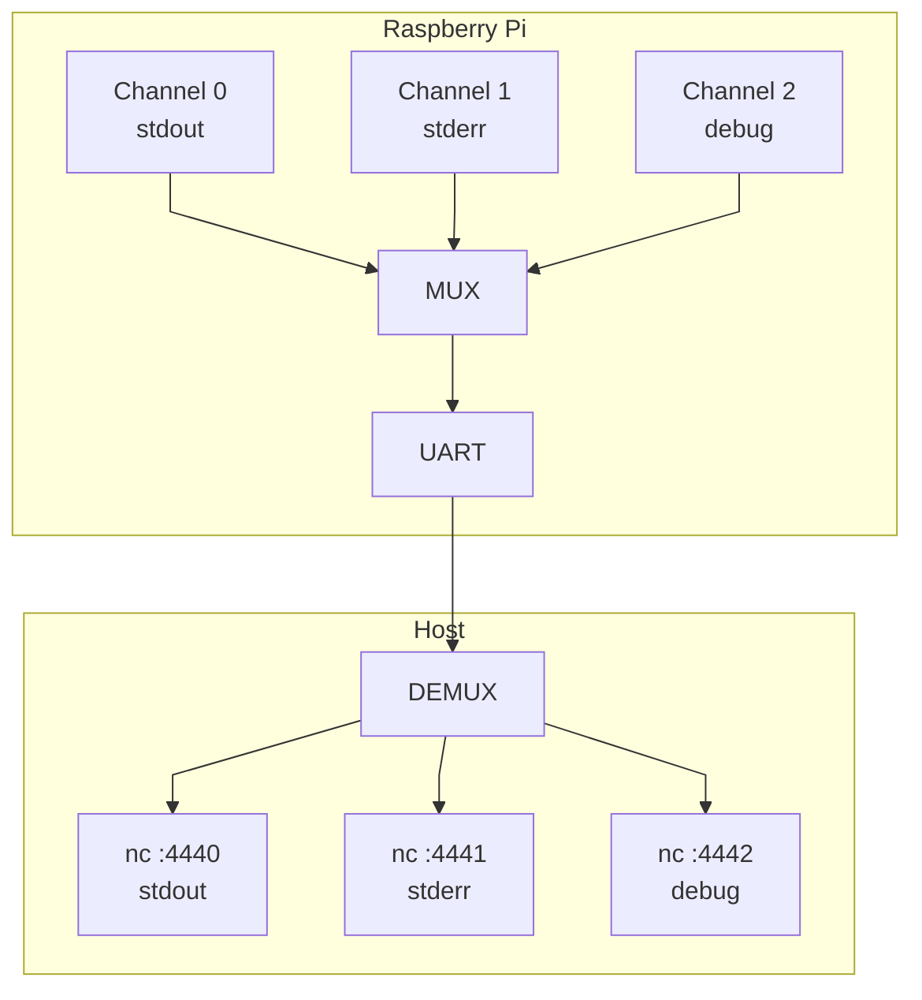

# Serial Multiplexing Protocol

RPiMetal includes a serial multiplexing protocol that allows multiple channels of communication over a single UART connection. This enables separate streams for stdout, stderr, debug output, file transfer, and more — all through a single serial port.

## Overview

In **plain mode**, the UART transmits raw ASCII text directly. This is simple but limits you to a single bidirectional stream.

In **muxed mode**, data is encapsulated in packets with channel identifiers, allowing multiple logical channels to share the same physical connection.



## Protocol Specification

### Packet Format

Each packet consists of a 4-byte header followed by the message payload:

| Field | Size | Type | Description |
|-------|------|------|-------------|
| Channel | 2 bytes | `int16_t` (signed) | Channel identifier. Negative values reserved for control. |
| Length | 2 bytes | `uint16_t` (unsigned) | Payload length in bytes (0-252) |
| Payload | 0-252 bytes | raw data | The message content |
| Padding | 0-7 bytes | zeros | Padding to align total packet size to 8-byte boundary |

Example for a 13 byte payload:


### Alignment Rule

The total packet size (header + payload + padding) must be a multiple of `LENGTH_MULT` (8 bytes):

```
total_size = HEADER_SIZE + length + padding
total_size % LENGTH_MULT == 0
```

Why 8 bytes? The Raspberry Pi UART driver and the kernel-side UART
interrupt configuration are tuned to the PL011 FIFO behavior. The
UART receive/transmit IRQs are commonly configured to fire when the
FIFO is half-full (8 bytes). To avoid partial FIFO fragments and
spurious interrupt-driven fragmentation, packets are aligned to an
8-byte boundary. The mux layer and the host-side multiplexer server
automatically add zero-padding when needed, so application code may
send arbitrary-length payloads and the mux will handle alignment.

Examples:
- Payload of 4 bytes: `4 + 4 = 8` → no padding needed
- Payload of 10 bytes: `4 + 10 = 14` → 2 bytes padding → 16 bytes total
- Payload of 252 bytes: `4 + 252 = 256` → no padding needed

### Channel Conventions

| Channel | Purpose |
|---------|---------|
| 0 | Standard output (stdout) |
| 1 | Standard error (stderr) |
| 2+ | User-defined channels |
| Negative | Reserved for control/metadata |

## Kernel-Side API

The multiplexing module is located in `modules/sys/mux/` and provides the following API (from `include/sys/mux.h`):

### Channel Management

```c
// Register a new channel with specified buffer size
bool mux_channel_add(int16_t channel, size_t buffer_size, bool complete);

// Unregister a channel
bool mux_channel_remove(int16_t channel);
```

The `complete` parameter controls flushing behavior:
- `true`: Only flush when a complete message is received
- `false`: Flush data as it becomes available

### Sending and Receiving

```c
// Send data on a channel (returns bytes actually sent)
size_t mux_send(int16_t channel, const char *data, size_t size);

// Receive data from a channel (returns bytes received)
size_t mux_recv(int16_t channel, char *buffer, size_t size);

// Check available data
size_t mux_rx_available(int16_t channel);
size_t mux_tx_available(int16_t channel);
```

### Callbacks

```c
// Called when data is available to read
bool mux_set_rx_callback(int16_t channel, void (*handler)(size_t available));

// Called when space is available to write
bool mux_set_tx_callback(int16_t channel, void (*handler)(size_t available));
```

### Example Usage

```c
#include <sys/mux.h>

void my_debug_handler(size_t available) {
    char buf[256];
    size_t n = mux_recv(2, buf, sizeof(buf));
    // Process debug commands...
}

int kernel_start() {
    // Channel 0 and 1 are auto-registered for stdio
    
    // Add a custom debug channel
    mux_channel_add(2, 512, false);
    mux_set_rx_callback(2, my_debug_handler);
    
    // Send data
    mux_send(0, "Hello stdout!\n", 14);
    mux_send(1, "Hello stderr!\n", 14);
    mux_send(2, "Debug message\n", 14);
    
    return 0;
}
```

## Host-Side Demultiplexer

The `multiplex` tool (`toolchain/multiplex.c`) runs on the host and demultiplexes the serial stream into separate channels.

### Building

The tool is built automatically:
```bash
make multiplex
```

Or manually:
```bash
gcc -g -o output/multiplex toolchain/multiplex.c
```

### Configuration File

The multiplexer reads a configuration file that maps channels to commands. Each line has the format:

```
<channel>,<command>
```

Example `config-mult.txt`:
```
0,nc localhost 4440
1,nc localhost 4441
```

This maps:
- Channel 0 → netcat listening on port 4440
- Channel 1 → netcat listening on port 4441

### Running

Start the multiplexer with socat to bridge serial/TCP:

```bash
make mux-tcp
```

This runs:
```bash
socat TCP-LISTEN:4444,reuseaddr,fork SYSTEM:'output/multiplex config-mult.txt',nofork
```

Then connect to individual channels:
```bash
# Terminal 1 - stdout
nc localhost 4440

# Terminal 2 - stderr  
nc localhost 4441
```

### How It Works

1. QEMU connects its serial port to TCP port 4444
2. `socat` bridges port 4444 to the `multiplex` process
3. `multiplex` reads packets from stdin (the serial stream)
4. For each packet, it:
   - Parses the channel and length from the header
   - Finds (or spawns) the command for that channel
   - Forwards the payload to that command's stdin
5. Output from commands is read, packaged into mux packets, and sent to stdout

## VS Code Terminal Integration

The dev container comes with preconfigured terminal layouts:

### Plain Mode Terminals
- **stdout**: Direct connection to QEMU serial port

### Muxed Mode Terminals
- **Muxer**: Runs the multiplexer
- **Channel 0**: stdout via mux
- **Channel 1**: stderr via mux

Switch between modes using the **Terminal Keeper** extension in the VS Code sidebar.

## Implementing Mux Support in Your Program

### Minimal Example (Plain Mode)

For simple programs, skip muxing entirely:

```c
#include <drivers/simple-uart.h>

int kernel_start() {
    uart_send_string("Hello, plain mode!\n");
    return 0;
}
```

Use with `bootloaders/linked` and the plain terminal.

### Muxed Example

For programs using multiplexing:

```c
#include <sys/mux.h>
#include <sys/printf.h>

static void putc_mux(void *p, char c) {
    mux_send(0, &c, 1);
}

int kernel_start() {
    // printf will output to channel 0
    init_printf(0, putc_mux);
    
    printf("This goes to stdout (channel 0)\n");
    mux_send(1, "This goes to stderr (channel 1)\n", 33);
    
    return 0;
}
```

Ensure your kernel includes the `sys/mux` module and use with the muxed terminal configuration.

## Troubleshooting

### No Output in Muxed Mode

1. Verify the multiplexer is running: `make mux-tcp`
2. Check `config-mult.txt` has correct channel mappings
3. Ensure your kernel includes `sys/mux` module
4. Verify UART module is initialized before mux

### Garbled Output

1. Check baud rate matches (default: 921600)
2. Restart the host-side multiplexer

### Channel Not Found

The multiplexer prints warnings for unknown channels:
```
Unknown channel 5, skipping packet
```

Add the channel to `config-mult.txt` or use an existing channel number.
